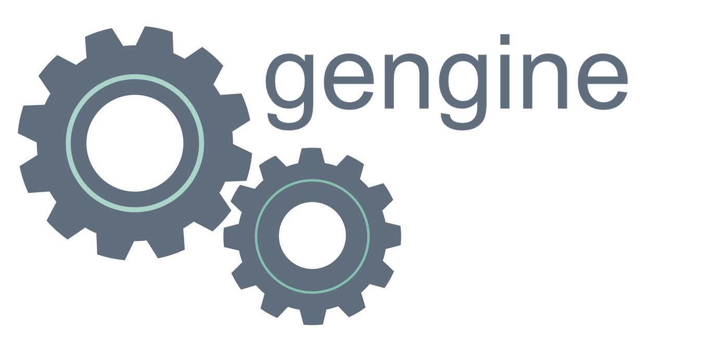
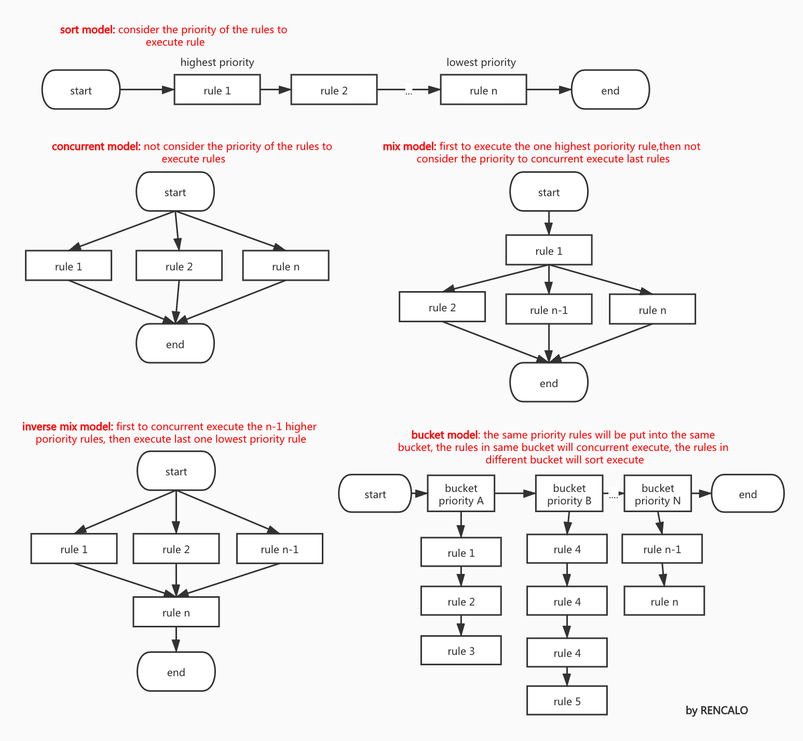

<div align="center">
  
</div>

[]()
[](https://github.com/bilibili/gengine/wiki) 

# Gengine
- [English document](README.md)

## 基于golang的规则引擎
- **Gengine**是一款基于AST(Abstract Syntax Tree)和golang语言实现的规则引擎(动态化加载框架)。能够让你在golang这种静态语言上，在不停服务的情况下实现动态加载与配置规则。
- **代码结构松散，逻辑极其简单，但经过了必要且详尽的测试**
- Gengine所支持的规则，就是一门**DSL**(领域专用语言)
- Gengine是一款高性能框架动态加载，与golang无缝对接，支持多种执行模式、支持规则池等满足各种业务场景需求

## 设计思想
- 可以看这篇文章: https://xie.infoq.cn/article/40bfff1fbca1867991a1453ac

## 官方文档
- 中文文档 https://github.com/bilibili/gengine/wiki

## 支持的执行模式
 

## 使用
- 建议使用最新版本
- go mod 或者 go vendor, go mod 引入:
```go
require github.com/bilibili/gengine v1.5.1
```

## 问题联系
- 提issue
- 或者加入QQ交流群1132683357